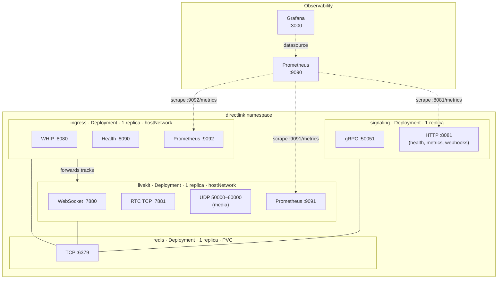

# Infrastructure

This document covers DirectLink's infrastructure architecture: Kubernetes topology, Kustomize base/overlay strategy, GKE deployment, CI/CD pipelines, container strategy, and observability.

## Kubernetes Topology

All backend services run in a single GKE cluster in the `directlink` namespace (base) or `directlink-dev` namespace (dev overlay). The cluster hosts four workloads and a persistence layer:



### hostNetwork Considerations

LiveKit and LiveKit Ingress both run with `hostNetwork: true` because they need direct access to the node's network interfaces for WebRTC UDP media and WHIP ingest. This has several implications:

- **Single replicas only:** Two pods with `hostNetwork: true` cannot bind the same ports on the same node. This is acceptable for dev — HPA would be inappropriate anyway given the Redis state coupling.
- **DNS policy:** Pods using `hostNetwork` default to the node's DNS resolver, which cannot resolve Kubernetes service names. The manifests set `dnsPolicy: ClusterFirstWithHostNet` so that service discovery (e.g. `redis.directlink-dev.svc.cluster.local`) works correctly.
- **Port conflicts:** The node's firewall must allow the bound ports (7880, 7881, 8080, 50000–60000/UDP).

### Label Conventions

All manifests use the `app.kubernetes.io/` label family:

- `app.kubernetes.io/name` — workload identity (e.g. `signaling`, `livekit`, `ingress`, `redis`)
- `app.kubernetes.io/component` — functional role (e.g. `signaling-server`, `sfu`, `ingress-server`, `datastore`)
- `app.kubernetes.io/part-of: directlink` — applied globally via Kustomize `labels` block
- `app.kubernetes.io/managed-by: kustomize` — applied globally

The Kustomize `labels` block uses `includeSelectors: false` (the `commonLabels` field is deprecated).

## Kustomize Strategy

DirectLink uses Kustomize for Kubernetes configuration management. The base manifests define the workload topology with placeholder values; overlays patch in environment-specific configuration.

```
infrastructure/kubernetes/
├── base/
│   ├── kustomization.yaml       # Resource list + global labels
│   ├── namespace.yaml
│   ├── configmap.yaml           # Shared config (LiveKit URLs, Redis addr)
│   ├── secret.yaml              # API keys (stringData, not base64)
│   ├── signaling/
│   │   ├── deployment.yaml
│   │   └── service.yaml
│   ├── redis/
│   │   ├── deployment.yaml
│   │   ├── service.yaml
│   │   └── pvc.yaml
│   ├── livekit/
│   │   ├── deployment.yaml
│   │   ├── service.yaml
│   │   └── configmap.yaml       # livekit.yaml config file
│   └── ingress/
│       ├── deployment.yaml
│       └── configmap.yaml       # ingress.yaml config file
└── overlays/
    └── dev/
        ├── kustomization.yaml   # Namespace override, patches, image rewriting
        ├── README.md            # Placeholder replacement guide
        └── patches/
            ├── configmap.yaml       # LIVEKIT_EXTERNAL_URL → node IP
            ├── secret.yaml          # Real dev API secret
            ├── livekit-config.yaml  # node_ip, whip_base_url → node IP
            └── ingress-config.yaml  # ws_url → cluster-internal, api_secret
```

### Base Manifests

Base manifests use generic placeholder values (`changeme` for secrets, `localhost` for URLs). They define the complete resource topology without any environment assumptions. Secrets use `stringData` instead of `data` to avoid manual base64 encoding.

Shared configuration lives in two resources:

- `directlink-config` (ConfigMap): LiveKit WebSocket URL, external URL, Redis address
- `directlink-secret` (Secret): LiveKit API key/secret, Redis password

Individual services have their own ConfigMaps for config files (e.g. `livekit-config` mounts `livekit.yaml`, `ingress-config` mounts `ingress.yaml`).

### Dev Overlay

The dev overlay patches three categories of values for GKE deployment:

**1. External IP injection:** The GKE node's external IP replaces `REPLACE_NODE_IP` in three locations:

| File | Field | Purpose |
|------|-------|---------|
| `patches/configmap.yaml` | `LIVEKIT_EXTERNAL_URL` | WebSocket URL returned to director clients |
| `patches/livekit-config.yaml` | `rtc.node_ip` | IP advertised in WebRTC ICE candidates |
| `patches/livekit-config.yaml` | `whip_base_url` | WHIP endpoint URL returned to camera clients |

**2. API secret injection:** `REPLACE_DEV_SECRET` must be consistent across three files (secret, LiveKit config `keys.devkey`, ingress config `api_secret`).

**3. Image path rewriting:** The `kustomization.yaml` `images` block rewrites `directlink/signaling:latest` to the Artifact Registry path `us-south1-docker.pkg.dev/PROJECT_ID/directlink/signaling:SHA`.

**4. Namespace override:** Dev overlay targets `directlink-dev` so base and dev resources don't collide if applied to the same cluster.

**5. Internal service addresses:** Overlay patches update Redis and LiveKit URLs from bare service names to fully-qualified cluster DNS names (e.g. `redis.directlink-dev.svc.cluster.local:6379`).

### Applying the Overlay

```bash
# Render and inspect
kubectl kustomize infrastructure/kubernetes/overlays/dev/

# Dry run
kubectl apply -k infrastructure/kubernetes/overlays/dev/ --dry-run=client

# Apply
kubectl apply -k infrastructure/kubernetes/overlays/dev/
```

After a node IP change (e.g. spot VM preemption), update `REPLACE_NODE_IP` in all three patch files and re-apply, then restart affected deployments:

```bash
kubectl rollout restart deployment/signaling deployment/livekit deployment/ingress -n directlink-dev
```

## GKE Cluster (Terraform)

The dev GKE cluster is provisioned via Terraform under `infrastructure/terraform/environments/dev/`.

### Cluster Specification

| Setting | Value | Rationale |
|---------|-------|-----------|
| Mode | Standard (not Autopilot) | Full control over node pools, hostNetwork support |
| Zone | `us-south1-a` | Single-zone, lower cost for dev |
| Node pool | 1 node, `e2-standard-2` | 2 vCPUs, 8GB RAM, sufficient for all dev workloads |
| VM type | Spot | ~60-80% cost savings, acceptable for dev (may preempt) |
| Disk | 30GB per node | Adequate for container images and logs |

### Firewall Rules

Terraform creates firewall rules for the GKE node:

| Port | Protocol | Purpose |
|------|----------|---------|
| 50051 | TCP | gRPC signaling |
| 7880 | TCP | LiveKit WebSocket |
| 7881 | TCP | LiveKit RTC TCP fallback |
| 8080 | TCP | WHIP ingest endpoint |
| 50000–60000 | UDP | WebRTC media |

### Cost Management

The dev cluster costs approximately $3–4/day if left running continuously. The recommended workflow:

- `terraform apply` to bring up the cluster for testing
- `terraform destroy` when done — the node will get a new external IP on re-provision
- Artifact Registry is managed separately so `terraform destroy` does not delete pushed images

Image path: `us-south1-docker.pkg.dev/directlink-dev/directlink/signaling`

## Container Strategy

### Signaling Server Dockerfile

The signaling server uses a multi-stage Docker build:

**Stage 1 (builder):** `golang:1.26-bookworm`

1. Install `protoc` from official release + Go protoc plugins
2. Copy `go.mod`/`go.sum` first for layer caching (`go mod download`)
3. Copy `shared/protocol/signaling.proto` and generate Go code
4. Copy backend source and build with `CGO_ENABLED=0`, `-trimpath`, and `-ldflags="-s -w"` for a minimal static binary

**Stage 2 (runtime):** `gcr.io/distroless/static-debian12:nonroot`

- Copies only the static binary from the builder
- Runs as UID 65532 (nonroot)
- Exposes 8081 (HTTP) and 50051 (gRPC)
- No shell, no package manager, minimal attack surface

The build context is the repository root (not `backend/`) because the Dockerfile needs access to `shared/protocol/` for proto generation.

### Production-Topology Local Testing

`docker-compose.prod.yaml` provides a production-like stack for testing the container image locally before pushing to GKE:

```bash
docker build -f backend/Dockerfile -t directlink/signaling:dev .
docker compose -f docker-compose.prod.yaml up
```

This stack mirrors the GKE topology: signaling runs from its built image (not source-mounted), talking to Redis, LiveKit, and Ingress. It validates that the container image works correctly with all dependencies.

## CI/CD Pipelines

### Backend CI (`backend-ci.yml`)

Triggered on pushes/PRs to `main` that modify `backend/`, `shared/protocol/`, or the workflow file. Runs two parallel jobs:

**Build & Test:**
1. Checkout → Setup Go 1.26 → Install protoc + Go plugins
2. Generate protobuf code (`make proto`)
3. `go build -v ./...`
4. `go vet ./...`
5. `go test -race -count=1 -tags=integration -timeout=5m ./...`

Tests run with a Redis service container for integration tests.

**Lint:**
1. Same checkout + Go + protoc setup
2. Generate protobuf code
3. `golangci-lint` v2 with 5-minute timeout

Lint config: `contextcheck`, `gosec`, `errorlint`, `staticcheck` enabled; `gosimple` merged into `staticcheck`; formatters (`gofmt`, `goimports`) in separate `formatters` block per golangci-lint v2 conventions.

### Video Core CI (`video-core-ci.yml`)

Triggered on pushes/PRs modifying `video-core/`, `.clang-format`, `.clang-tidy`, or the workflow. Three parallel jobs:

1. **Build & Test:** Install FFmpeg dev libs + gtest, run `make test`
2. **Format Check:** LLVM 18 `clang-format`, run `make format-check`
3. **Lint:** LLVM 18 `clang-tidy`, generate `compile_commands.json` via CMake, run `make lint`

### Docker Publish (`docker-publish.yml`)

Triggered on pushes to `main` that modify `backend/`, `shared/protocol/`, or `backend/Dockerfile`. Uses Workload Identity Federation (no service account key) to authenticate to GCP:

1. Authenticate to GCP via Workload Identity Federation
2. Configure Docker for Artifact Registry
3. Build with Docker Buildx
4. Push with two tags: `SHA` (immutable) and `latest` (mutable pointer)

Image destination: `us-south1-docker.pkg.dev/directlink-dev/directlink/signaling`

All workflows use `concurrency` groups with `cancel-in-progress: true` to avoid stacking builds on rapid pushes.

## Observability

### Prometheus

Prometheus scrapes three targets in the dev environment:

| Target | Port | Path | Scrape Interval |
|--------|------|------|-----------------|
| Signaling server | 8081 | `/metrics` | 5s |
| LiveKit | 9091 | `/metrics` | 5s |
| LiveKit Ingress | 9092 | `/metrics` | 5s |

The signaling server uses a custom Prometheus registry (not the global default) to avoid metric collisions. This registry includes Go runtime collectors, process collectors, and all custom business metrics.

In the devcontainer Docker Compose stack, the Ingress runs with `network_mode: host`, so Prometheus scrapes it via `host.docker.internal:9092`.

### Grafana

Grafana dashboards are version-controlled and automatically provisioned:

- Datasource provisioning: `infrastructure/monitoring/grafana/provisioning/datasources/`
- Dashboard provisioning: `infrastructure/monitoring/grafana/provisioning/dashboards/`
- Dashboard JSON: `infrastructure/monitoring/grafana/dashboards/`

Dev credentials: `admin`/`admin`. Grafana data is persisted via a Docker volume.

### Key Metrics to Monitor

| Category | Metrics | Alert Threshold |
|----------|---------|-----------------|
| Session health | `directlink_sessions_active`, `directlink_sessions_created_total` | Active sessions dropping to 0 during demo |
| Join latency | `grpc_server_handling_seconds{method="JoinSession"}` | p99 > 500ms |
| Redis health | `directlink_redis_operation_duration_seconds`, `directlink_redis_errors_total` | Error rate > 0 sustained |
| Ingress health | LiveKit Ingress metrics on :9092 | Ingress creation failures |
| LiveKit SFU | LiveKit metrics on :9091 (room count, participant count, track forwarding) | Room count mismatch with active sessions |

## Development Environment

The project uses a VS Code devcontainer with Docker-outside-of-Docker (DooD):

- The devcontainer mounts `/var/run/docker.sock` from the host, sharing the Docker daemon
- Built images and Compose networks are visible from both inside and outside the devcontainer
- The full dev stack (Redis, LiveKit, Ingress, Prometheus, Grafana) runs via `.devcontainer/docker-compose.yaml`
- A `dev-gpu` profile extends the base with NVIDIA GPU passthrough for NVENC/NVDEC testing

### Dev Stack vs. GKE

| Concern | Local Dev (Docker Compose) | GKE (Kustomize Overlay) |
|---------|---------------------------|------------------------|
| Signaling server | Source-mounted, `go run` | Container image from Artifact Registry |
| LiveKit URLs | `localhost:7880` | `NODE_IP:7880` |
| Redis | `redis:6379` | `redis.directlink-dev.svc.cluster.local:6379` |
| UDP port range | 50200–50300 (narrowed for Docker overhead) | 50000–60000 (hostNetwork, no mapping overhead) |
| Ingress networking | `network_mode: host` | `hostNetwork: true` + `ClusterFirstWithHostNet` |
| Monitoring | Prometheus + Grafana in Compose | Planned: Prometheus + Grafana in cluster |
