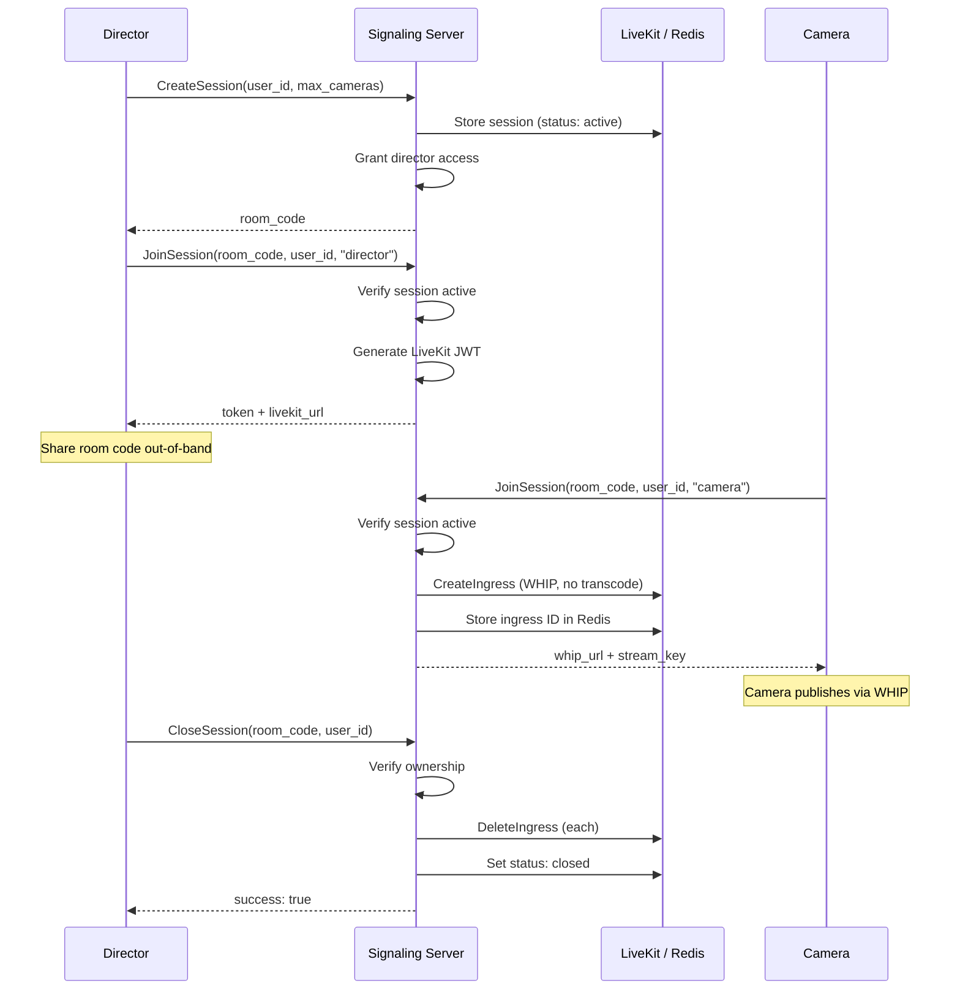

# Signaling Protocol

The DirectLink signaling server is a Go gRPC service that acts as the authorization and control plane for production sessions. It manages session lifecycle, distributes role-specific credentials, and coordinates LiveKit ingress resources. The server never touches media — once credentials are issued, clients connect directly to LiveKit.

## gRPC API

The API is defined in `shared/protocol/signaling.proto` and exposes four RPCs under `SignalingService`:

```protobuf
service SignalingService {
    rpc CreateSession(CreateSessionRequest) returns (CreateSessionReply);
    rpc JoinSession(JoinRequest) returns (JoinReply);
    rpc CloseSession(CloseSessionRequest) returns (CloseSessionReply);
    rpc GetMySessions(GetMySessionsRequest) returns (GetMySessionsReply);
}
```

gRPC reflection is enabled, so `grpcurl` can discover the API without pointing at the proto file.

### CreateSession

Creates a new production session. The caller becomes the session owner (director).

**Request:** `user_id` (string), `max_cameras` (int32)

**Response:** `room_code` (string) — a human-readable code like `ROOM-000472` for sharing with camera operators.

**Server behavior:**

1. Validate that `user_id` and `max_cameras` are present
2. Generate a UUID for the session ID and a unique room code
3. Store the session in Redis with status `active`
4. Grant the creator `director` access
5. Increment `directlink_sessions_created_total` and `directlink_sessions_active` metrics

### JoinSession

Authenticates a user to an active session and returns role-specific credentials. This is the core branching point in the protocol.

**Request:** `room_code` (string), `user_id` (string), `role` (string — `"camera"` or `"director"`)

**Response fields vary by role:**

| Role | Returned Fields | Empty Fields |
|------|----------------|--------------|
| `director` | `token` (LiveKit JWT), `livekit_url` (WebSocket URL) | `whip_url`, `stream_key` |
| `camera` | `whip_url` (WHIP endpoint), `stream_key` (auth token) | `token`, `livekit_url` |

**Server behavior (shared):**

1. Validate `user_id`, `role`, and `room_code` are present
2. Look up the session by room code in Redis
3. Verify the session status is `active` (reject if `closed`)
4. Grant the user access with the specified role

**Camera branch (`joinAsCamera`):**

1. Call LiveKit `CreateIngress` with type `WHIP_INPUT`, the session ID as the room name, the user ID as participant identity, and transcoding disabled
2. Store the returned ingress ID in the session's ingress set in Redis
3. Return the WHIP URL and stream key from the ingress response

**Director branch (`joinAsDirector`):**

1. Build a LiveKit JWT using the API key/secret with permissions: `canSubscribe: true`, `canPublish: false`
2. Set the token identity to the user ID and the room to the session ID
3. Return the token and the externally-reachable LiveKit WebSocket URL (`LiveKitExternalURL` config field)

### CloseSession

Closes an active session. Only the session owner can close it.

**Request:** `room_code` (string), `user_id` (string)

**Response:** `success` (bool)

**Server behavior:**

1. Validate `room_code` and `user_id` are present
2. Look up the session by room code
3. Verify `user_id` matches `created_by` (return `PermissionDenied` otherwise)
4. Retrieve all ingress IDs from the session's Redis set
5. Delete each ingress via LiveKit `DeleteIngress`
6. Update session status to `closed` in Redis
7. Decrement `directlink_sessions_active` metric

### GetMySessions

Returns all sessions created by a given user.

**Request:** `user_id` (string)

**Response:** `sessions` (repeated `SessionInfo`) — each entry contains `session_id`, `room_code`, `status`, `max_cameras`, `created_at` (RFC 3339)

## Session Lifecycle



## Redis Data Model

The session store (`pkg/session/`) uses Redis with the following key patterns:

| Key Pattern | Type | Contents |
|-------------|------|----------|
| `session:{session_id}` | Hash | Session metadata: room code, creator, status, max cameras, timestamps |
| `roomcode:{room_code}` | String | Maps room code → session ID for lookup |
| `session:{session_id}:access` | Hash | User ID → role mappings for access control |
| `session:{session_id}:ingress_ids` | Set | LiveKit ingress IDs created for this session |
| `user:{user_id}:sessions` | Set | Session IDs created by this user (for `GetMySessions`) |
| `sessions:active` | Sorted Set | Tracks active session IDs (scored by expiry timestamp for TTL-based pruning) |

All session data is written with a configurable TTL (`SessionTTL` in server config, default 24 hours) to prevent stale data accumulation.

## Configuration

The signaling server is configured via environment variables:

| Variable | Purpose | Example |
|----------|---------|---------|
| `REDIS_ADDR` | Redis connection address | `redis:6379` |
| `REDIS_PASSWORD` | Redis password (empty for dev) | `""` |
| `LIVEKIT_HOST` | Internal LiveKit HTTP URL (for SDK calls) | `http://livekit:7880` |
| `LIVEKIT_EXTERNAL_URL` | Client-reachable LiveKit WebSocket URL | `ws://NODE_IP:7880` |
| `LIVEKIT_API_KEY` | LiveKit API key | `devkey` |
| `LIVEKIT_API_SECRET` | LiveKit API secret | (32+ char string) |

The distinction between `LIVEKIT_HOST` and `LIVEKIT_EXTERNAL_URL` is important: `LIVEKIT_HOST` is the internal service name used by the Go SDK to call LiveKit APIs (e.g. `CreateIngress`). `LIVEKIT_EXTERNAL_URL` is the externally-reachable WebSocket URL returned to director clients in `JoinReply.livekit_url`.

## Access Control

DirectLink uses a simplified access model for the MVP:

- **Room code as access control:** Knowing a valid, active room code is sufficient to join. The server auto-grants access on `JoinSession`.
- **Ownership enforcement:** Only the session creator (`created_by`) can call `CloseSession`.
- **LiveKit permissions are role-based:** Director tokens have `canSubscribe: true`, `canPublish: false` (data publishing is not currently granted). Camera operators publish via WHIP (permissions enforced by the ingress, not a JWT).
- **No user authentication:** The MVP does not include login or identity verification. User IDs are self-reported.

## Error Handling

The server uses standard gRPC status codes:

| Condition | Code | Message |
|-----------|------|---------|
| Missing required field | `InvalidArgument` | `"user_id is required"`, `"role is required"`, etc. |
| Room code not found | `NotFound` | `"session not found"` |
| Session already closed | `FailedPrecondition` | `"session is closed"` |
| Non-owner tries to close | `PermissionDenied` | `"only the session owner can close it"` |
| Invalid role string | `InvalidArgument` | `"role must be 'camera' or 'director'"` |
| LiveKit ingress creation fails | `Internal` | `"failed to create ingress"` |
| Redis operation fails | `Internal` | `"failed to create session"`, etc. |

## Testing

The signaling server uses two test strategies:

**Unit tests** (colocated with packages): Test individual functions with mock dependencies. The `ingressClient` interface defined at the point of consumption enables mock injection — `mockIngressClient` stubs `CreateIngress` and `DeleteIngress` for deterministic testing. Tests use the table-driven pattern (`tests []struct{ name string; ... }` with `t.Run`).

**Integration tests** (`-tags=integration`): Require a running Redis instance. Test full RPC flows: `CreateSession` → `JoinSession` → `CloseSession` lifecycle, ownership enforcement, room code lookup, and `GetMySessions` pagination. CI runs these with a Redis service container.

## Observability

The server exposes metrics on `:8081/metrics` via a custom Prometheus registry:

| Metric | Type | Description |
|--------|------|-------------|
| `directlink_sessions_active` | Gauge | Currently active sessions |
| `directlink_sessions_created_total` | Counter | Total sessions created |
| `directlink_token_generations_total` | Counter (by role) | LiveKit tokens/credentials generated |
| `directlink_redis_operation_duration_seconds` | Histogram (by operation) | Redis call latency |
| `directlink_redis_errors_total` | Counter (by operation) | Redis operation failures |
| `grpc_server_handling_seconds` | Histogram | Per-RPC latency (via go-grpc-middleware) |

gRPC server metrics are registered via `grpc-ecosystem/go-grpc-middleware` with custom latency histogram buckets ranging from 1ms to 1s.