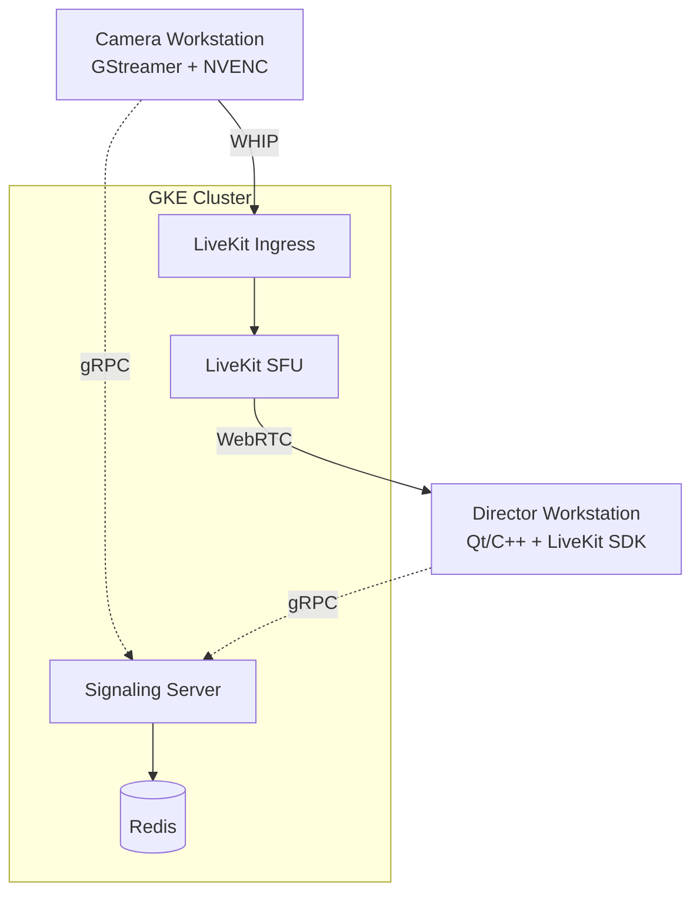

# System Overview

DirectLink is a real-time video streaming platform built for professional film and TV remote production. It targets sub-150ms end-to-end latency (sub-100ms stretch goal), enabling directors to view and control multiple camera feeds remotely with near-zero delay.

## Architecture Summary

DirectLink follows a control-plane / media-plane separation. The **Go signaling server** handles session management, authorization, and credential distribution over gRPC. The **LiveKit SFU** handles all real-time media routing over WebRTC. These two planes never mix — the signaling server issues credentials, and clients connect directly to LiveKit for media.



## Components

### Signaling Server (Go)

The signaling server is the authorization and control plane. It exposes a gRPC API defined in `shared/protocol/signaling.proto` and an HTTP server for health checks, Prometheus metrics, and LiveKit webhooks.

Key responsibilities:

- **Session management:** Create, join, close, and list production sessions. Sessions are keyed by UUID internally and identified externally by human-readable room codes (e.g. `ROOM-000472`).
- **Role-based credential distribution:** `JoinSession` branches by role. Camera operators receive WHIP credentials (URL + stream key) after the server creates a LiveKit ingress. Directors receive a LiveKit JWT token + WebSocket URL.
- **Ingress lifecycle:** Camera joins trigger `CreateIngress` via the LiveKit server SDK. Ingress IDs are tracked as a Redis set per session and cleaned up on `CloseSession` via `DeleteIngress`.
- **Observability:** Custom Prometheus registry with session metrics (active count, created total, token generations by role), Redis operation histograms, and gRPC server metrics via `go-grpc-middleware`.

The server does **not** touch media. Once credentials are issued, clients connect directly to LiveKit.

Source: `backend/cmd/signaling/`, `backend/internal/signaling/`, `backend/pkg/`

### LiveKit SFU

LiveKit is deployed as a sidecar service and handles all WebRTC media routing. It auto-creates rooms on the first participant join — no explicit room creation call is needed from the signaling server.

Configuration highlights for the dev environment:

- WebSocket signaling on port 7880, RTC TCP fallback on 7881
- UDP media port range: 50000–60000 (GKE) or 50200–50300 (local Docker Compose, narrowed to reduce port mapping overhead)
- ICE Lite mode enabled
- Redis-backed for distributed state
- Webhook notifications sent to the signaling server's `/webhooks/livekit` endpoint

### LiveKit Ingress

LiveKit Ingress accepts WHIP publish requests from camera operators and bridges them into LiveKit rooms as standard WebRTC tracks. It runs with `hostNetwork: true` in Kubernetes because WHIP negotiation requires direct UDP connectivity.

Key configuration:

- WHIP endpoint on port 8080
- Transcoding disabled (`EnableTranscoding: false`) — H.264 from NVENC passes through untouched
- Each camera operator gets a dedicated ingress instance (created per `JoinSession` camera call)
- Ingress IDs stored in Redis and cleaned up when the session closes

### Qt Desktop Client (C++)

The client application is built with Qt 6 and serves two distinct roles:

**Director mode (partially implemented):** Will connect to LiveKit via the C++ SDK using the JWT token from `JoinSession`, subscribe to video tracks, decode via NVDEC, and render in a multi-camera grid view. The LiveKit SDK integration and frame rendering pipeline are not yet wired end-to-end — see [Video Pipeline](video-pipeline.md#director-subscribe-path-planned) for current status.

**Camera mode:** Receives WHIP credentials from `JoinSession`, initializes `CameraSession` which wires `CameraCapture` → video-core encode pipeline → `WHIPPublisher` GStreamer pipeline → WHIP endpoint.

gRPC communication uses Qt's native protobuf/gRPC integration (`Qt Protobuf` + `Qt GRPC` modules) with `QGrpcHttp2Channel`. Stubs are generated at CMake configure time from `shared/protocol/signaling.proto`.

Source: `client/src/`, `networking/`, `video-core/`

> The `NvdecDecoder` class exists in video-core but is not yet integrated into the client's display pipeline.

### Redis

Redis serves as the session state store. It holds:

- Session metadata (UUID, room code, creator, status, max cameras, timestamps)
- Room code → session ID mappings for lookup
- User access grants per session
- Ingress ID sets per session (for cleanup on close)
- Creator → session list mappings for `GetMySessions`

Redis is also used by LiveKit internally for distributed room state and by LiveKit Ingress for coordination.

### Observability Stack

**Prometheus** scrapes three targets: the signaling server (`:8081/metrics`), LiveKit (`:9091/metrics`), and LiveKit Ingress (`:9092/metrics`). Scrape interval is 5s in dev.

**Grafana** provides dashboards for session metrics, latency percentiles, Redis operation durations, and system health. Dashboards and datasource provisioning are version-controlled under `infrastructure/monitoring/grafana/`.

## Data Flow

### Camera Publish Path

1. Director creates a session via `CreateSession` → receives a room code
2. Camera operator calls `JoinSession` with the room code and `role: "camera"`
3. Signaling server calls LiveKit `CreateIngress` (WHIP type, transcoding disabled)
4. Server returns the WHIP URL and stream key to the camera client
5. Client initializes `CameraSession`: `CameraCapture` (v4l2/dshow) → video-core encoder (NVENC, H.264) → `WHIPPublisher` (GStreamer: `appsrc → h264parse → rtph264pay → whipsink`)
6. `whipsink` POSTs the SDP offer to the WHIP URL, negotiates WebRTC, and begins streaming
7. LiveKit Ingress forwards the H.264 track untranscoded into the LiveKit room

### Director Subscribe Path (Partially Implemented)

1. Director calls `JoinSession` with `role: "director"`
2. Signaling server generates a LiveKit JWT with subscribe-only permissions and returns it with the LiveKit WebSocket URL
3. *Steps 3-5 are planned but not yet implemented end-to-end — see [Video Pipeline](video-pipeline.md#director-subscribe-path-planned)*

### Session Teardown

1. Director calls `CloseSession` with their user ID (ownership verified)
2. Signaling server retrieves the ingress ID set from Redis
3. Each ingress is deleted via `DeleteIngress`
4. Session status is set to `closed` in Redis
5. Active session gauge is decremented in Prometheus metrics

## Technology Choices

| Decision | Choice | Rationale |
|----------|--------|-----------|
| SFU | LiveKit (replaced Pion/ion-sfu) | Production-grade, built-in WHIP ingress support, C++ client SDK, Redis-backed distributed state |
| Signaling protocol | gRPC/protobuf | Type-safe contracts shared between Go server and C++ client, streaming support if needed later |
| Session store | Redis | Low-latency reads for session lookups, pub/sub capability, shared dependency with LiveKit |
| Video ingest | WHIP via LiveKit Ingress | Standard WebRTC ingest protocol, avoids custom SDP exchange, GStreamer `whipsink` support |
| Hardware encoding | NVENC (NVIDIA) | Sub-millisecond encode latency, zero B-frames for low latency, zero-copy GPU pipeline |
| Client framework | Qt 6 (C++) | Native performance for video rendering, cross-platform, built-in protobuf/gRPC support |
| Infrastructure | GKE + Kustomize + Terraform | Production-grade Kubernetes, declarative config management, reproducible infrastructure |

## Repository Layout

```
direct-link/
├── .devcontainer/          # VS Code dev container (Docker-outside-of-Docker)
├── .github/workflows/      # CI: backend-ci.yml, video-core-ci.yml, docker-publish.yml
├── backend/                # Go signaling server
│   ├── cmd/signaling/      # Entry point
│   ├── internal/signaling/ # Server implementation
│   ├── pkg/                # Shared packages (metrics, session, logger)
│   ├── configs/            # LiveKit, Ingress, Prometheus config files
│   └── Dockerfile          # Multi-stage build, distroless runtime
├── client/                 # Qt 6 desktop application
│   └── src/
│       ├── network/        # SessionClient (gRPC)
│       ├── session/        # CameraSession
│       └── ui/             # QML UI components
├── video-core/             # C++ video capture + encode library
├── networking/             # C++ networking library (WHIPPublisher)
├── shared/protocol/        # signaling.proto (single source of truth)
├── infrastructure/
│   ├── kubernetes/
│   │   ├── base/           # Kustomize base manifests
│   │   └── overlays/dev/   # GKE dev overlay
│   ├── terraform/          # GKE cluster provisioning
│   └── monitoring/         # Grafana dashboards + provisioning
├── docs/                   # Project documentation
└── scripts/                # Build and utility scripts
```