# Video Pipeline

This document describes the end-to-end media path in DirectLink, from camera capture through encoding, ingest, SFU routing, and director-side decode and display. The pipeline is designed for sub-150ms end-to-end latency using GPU-accelerated encoding/decoding and the WHIP ingest protocol.

## Pipeline Overview

```mermaid
graph LR
    subgraph camera["Camera Workstation"]
        direction TB
        capture["CameraCapture<br>(v4l2 / dshow)"]
        encoder["video-core Encoder<br>(NVENC, H.264)"]
        whip_pub["WHIPPublisher<br>(GStreamer pipeline)"]
        whipsink["whipsink"]
        capture --> encoder --> whip_pub --> whipsink
    end

    subgraph cluster["GKE Cluster"]
        direction TB
        ingress_svc["LiveKit Ingress<br>(WHIP receiver)"]
        passthrough["H.264 passthrough<br>(no transcode)"]
        sfu["LiveKit SFU<br>(selective forward)"]
        ingress_svc --> passthrough --> sfu
    end

    subgraph director["Director Workstation (planned)"]
        direction TB
        sdk["LiveKit C++ SDK<br>(track subscribe)"]
        nvdec["NVDEC Decode<br>(H.264 → raw)"]
        converter["Frame Conversion<br>(→ ARGB)"]
        qt["QVideoSink<br>(multi-cam grid)"]
        sdk --> nvdec --> converter --> qt
    end

    whipsink -- "WHIP" --> ingress_svc
    sfu -- "WebRTC" --> sdk
```



## Camera Publish Path

### 1. Video Capture (`video-core/`)

`CameraCapture` acquires raw frames from the system camera using FFmpeg's `libavdevice`:

- **Linux:** `/dev/video0` via `v4l2`
- **Windows:** `video=0` via `dshow`
- **Resolution:** 1920×1080 at 30fps (60fps stretch goal)

Captured frames are placed into a bounded frame buffer with backpressure to prevent unbounded memory growth if encoding falls behind.

**Latency consideration:** The capture layer should output NV12 pixel format directly to match NVENC's native input. Using `videoconvert` in GStreamer to convert pixel formats adds measurable latency and should be avoided.

### 2. Hardware Encoding (`video-core/`)

The video-core encoder wraps NVENC (NVIDIA Video Codec SDK) for hardware-accelerated H.264 encoding:

- **Codec:** H.264 Baseline/Main profile
- **Preset:** `UltraFast` (maps to NVENC low-latency preset)
- **Rate control:** 4 Mbps target bitrate (tunable). No explicit rate control mode is configured; FFmpeg/NVENC defaults apply.
- **B-frames:** Zero (critical for low latency — B-frames add reordering delay)
- **Encoding latency:** Sub-millisecond on modern NVIDIA GPUs

The encoder produces `AVPacket` structures containing H.264 byte-stream NAL units. Each packet carries a PTS timestamp from the capture layer for end-to-end latency measurement.

A callback wired during `pipeline_.start()` passes each encoded packet to the `WHIPPublisher`.

### 3. WHIP Publishing (`networking/`)

`WHIPPublisher` wraps a GStreamer pipeline that takes encoded H.264 packets and publishes them over WHIP (WebRTC-HTTP Ingress Protocol):

```
appsrc → h264parse → rtph264pay → whipsink
```

**Pipeline elements:**

- **`appsrc`:** Receives encoded H.264 byte-stream buffers pushed from video-core via `pushPacket()`. Configured as live source with zero min/max latency and a 512KB buffer cap.
- **`h264parse`:** Parses H.264 NAL units and ensures proper framing for RTP packetization.
- **`rtph264pay`:** Packetizes H.264 into RTP packets suitable for WebRTC transport.
- **`whipsink`:** Performs WHIP signaling (HTTP POST with SDP offer to the WHIP URL) and establishes a WebRTC connection for media transport. The stream key authenticates the publish request.

**Lifecycle:**

1. `initialize()` builds the GStreamer pipeline, configures `appsrc` caps for `video/x-h264` byte-stream, and sets the WHIP endpoint URL and authorization token on `whipsink`
2. Pipeline is set to `PLAYING` state
3. `pushPacket()` is called per encoded frame — maps the `AVPacket` data into a `GstBuffer`, sets PTS and duration, and pushes via `appsrc`
4. `stop()` sends EOS through the pipeline, waits up to 3 seconds for propagation, then sets the pipeline to `NULL`

**Error handling:** If `push-buffer` returns anything other than `GST_FLOW_OK`, the error callback fires. EOS timeout also triggers an error notification.

### 4. CameraSession Integration (`client/src/session/`)

`CameraSession` ties the capture, encode, and publish stages together:

```cpp
pipeline_.initialize(captureConfig, encoderConfig);
whipPublisher_.initialize(whipUrl, streamKey, framerate, errorCallback);
pipeline_.start([this](std::unique_ptr<videoCore::Packet> pkt) {
    whipPublisher_.pushPacket(std::move(pkt));
});
```

The WHIP URL and stream key come from the signaling server's `JoinSession` response (camera role). The client receives these via `SessionClient::cameraJoined(whipUrl, streamKey)`.

## Server-Side Media Path

### 5. LiveKit Ingress

LiveKit Ingress receives the WHIP publish and bridges it into a LiveKit room as a standard WebRTC track:

- **Input:** WHIP (HTTP POST for SDP exchange, then WebRTC media)
- **Transcoding:** Disabled (`EnableTranscoding: false`). The H.264 stream from NVENC passes through untouched — no re-encoding overhead.
- **Room assignment:** The ingress is created with the session ID as the room name. LiveKit auto-creates the room on the first participant.
- **Participant identity:** Set to the camera operator's user ID from the `JoinSession` request.

Each camera operator gets a dedicated ingress instance. Multiple cameras in the same session publish to the same LiveKit room through separate ingress entries.

### 6. LiveKit SFU

LiveKit selectively forwards the H.264 RTP packets to subscribed participants (directors). There is no transcoding or re-encoding at the SFU layer — it operates as a pure selective forwarding unit.

- **ICE Lite:** Enabled to simplify NAT traversal
- **Transport:** UDP preferred, TCP fallback on port 7881
- **UDP port range:** 50000–60000 (GKE), 50200–50300 (local dev)

## Director Subscribe Path (Planned)

> **Note:** The director subscribe path is partially implemented. The architecture below describes the target design. `SessionClient` handles gRPC credential retrieval, but the LiveKit C++ SDK integration, hardware decode pipeline, and frame rendering are not yet wired end-to-end.

### 7. LiveKit C++ SDK (`client/src/network/`)

The director client will connect to LiveKit using the JWT token from `JoinSession`:

1. Create a `livekit::Room` instance and connect with the token and LiveKit URL
2. Implement `RoomDelegate` callbacks:
   - `onTrackSubscribed` — new camera track available
   - `onTrackUnsubscribed` — camera disconnected
   - `onParticipantConnected` / `onConnectionStateChanged` — connection lifecycle
3. For each subscribed video track, create a `VideoStream` that delivers decoded frames via callback

### 8. Hardware Decoding

NVDEC (NVIDIA hardware decoder) will decode the received H.264 stream back to raw frames. The `NvdecDecoder` class exists in `video-core/include/decode/nvdec_decoder.hpp` but is not yet integrated into the client pipeline.

- **Input:** H.264 NAL units from the WebRTC track
- **Output:** Raw video frames (NV12 or similar GPU surface format)
- **Fallback:** Software decode path for machines without NVIDIA GPUs

### 9. Frame Conversion and Display (Planned)

The display pipeline will convert decoded frames from NV12/GPU format to ARGB for Qt's `QVideoFrame` rendering. This conversion layer is not yet implemented.

Target Qt UI for multi-camera grid view:

- Each track SID maps to a video stream instance
- Thumbnails show all connected cameras
- Active camera selection promotes a feed to the main view
- Latency overlay displays measured round-trip time

## Latency Budget

Target: sub-150ms end-to-end (capture to display).

| Stage | Expected Latency | Notes |
|-------|-----------------|-------|
| Camera capture | ~16ms | One frame at 60fps, ~33ms at 30fps |
| NVENC encode | <1ms | Hardware encoder, zero B-frames |
| GStreamer pipeline overhead | ~2-5ms | appsrc → h264parse → rtph264pay → whipsink |
| WHIP signaling + transport | ~1-2ms | Initial HTTP POST, then direct UDP |
| Network (camera → server) | ~5-30ms | Depends on geographic distance |
| LiveKit Ingress passthrough | <1ms | No transcode, direct forward |
| LiveKit SFU forwarding | <1ms | Selective forwarding, no processing |
| Network (server → director) | ~5-30ms | Depends on geographic distance |
| WebRTC jitter buffer | ~20-50ms | Adaptive, trades latency for smoothness |
| NVDEC decode | <1ms | Hardware decoder |
| ARGB conversion + render | ~1-2ms | toARGB() + QVideoSink |
| **Total** | **~50-130ms** | Well within 150ms target |

The WebRTC jitter buffer is the largest single contributor and is the primary tuning target. NVENC's zero-B-frame configuration minimizes encoding latency.

## Codec and Format Details

| Parameter | Value |
|-----------|-------|
| Codec | H.264 (AVC) |
| Profile | Baseline or Main |
| Encoder | NVENC (NVIDIA hardware) |
| Decoder | NVDEC (NVIDIA hardware), software fallback |
| Resolution | 1920×1080 |
| Frame rate | 30fps (60fps stretch) |
| Bitrate | 4 Mbps target (rate control mode not explicitly set) |
| B-frames | 0 (zero-latency) |
| Pixel format (capture) | NV12 preferred |
| Pixel format (display) | ARGB (Qt QVideoFrame) |
| Container | RTP (via WebRTC) |
| Ingest protocol | WHIP (WebRTC-HTTP Ingress Protocol) |

## Multi-Camera Support

Each camera operator gets its own independent pipeline:

1. Camera joins → signaling server creates a new ingress → unique WHIP URL + stream key
2. Camera initializes its own `CameraSession` (capture + encode + WHIPPublisher)
3. Each ingress publishes to the same LiveKit room as a distinct participant/track
4. Director's LiveKit SDK receives `onTrackSubscribed` for each new camera
5. UI creates a new `VideoStream` and adds a thumbnail to the grid

Designed for 4 cameras, validated with 1-2 initially. The signaling server tracks ingress IDs as a set per session so all are cleaned up on `CloseSession`.